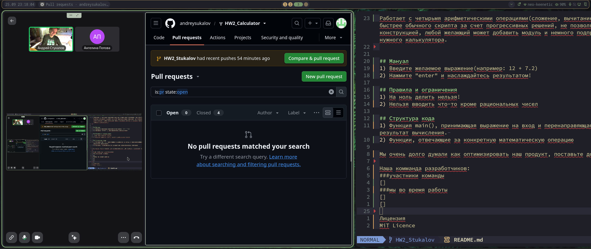

# Our Calculator
Работает с четырьмя арифметическими операциями(сложение, вычитание, умножение и деление) между двумя числами. Он работает быстрее обычного скрипта за счет прогрессивных решений, не позволяет вам совершить некоторые ошибки и является модульной конструкцией, любой желающий может добавить модуль и немного подправив код внести вклад в создание очередного очень важного и нужного калькулятора.

## Мануал
1) Введите желаемое выражение(например: 12 + 7.2)

2) Нажмите "enter" и наслаждайтесь результатом!

## Правила и ограничения
1) На ноль делить нельзя!

2) Нельзя вводить что-то кроме рациональных чисел

## Структура кода
1) Функция main(), принимающая выражение на вход и перенаправяющая его в конкретную вычислительную функцию и принимающая результат вычисления.

2) Функции, отвечающие за конкретную математическую операцию

Мы очень долго думали как оптимизировать наш продукт, поставьте доп быллы, пж!

## Наша комманда разработчиков:
#### участники команды

#### мы во время работы

### Лицензия MiT Licence
